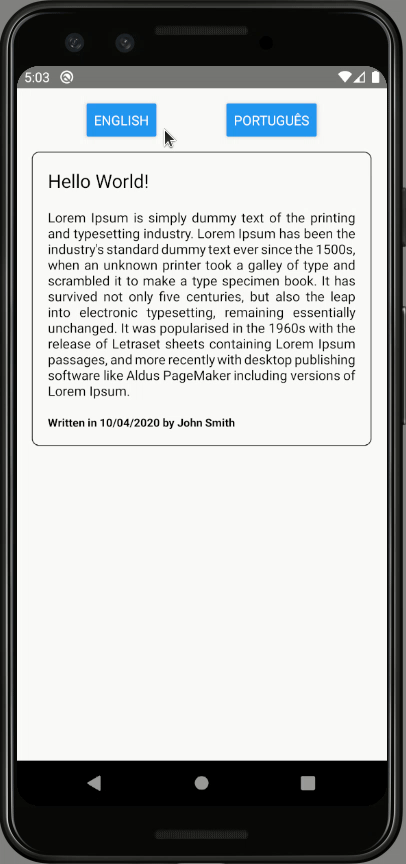

# POC: Internationalization (I18N)

It demonstrates how to use JSON files to define strings in multiple languages and update the UI according to the user preference.

## How to run

| Description | Command |
| :--- | :--- |
| Install dependencies | `npm install` |
| Run tests | `npm test` |
| Start Metro | `npm start` |
| Run app | `npm run android` |

## Preview

